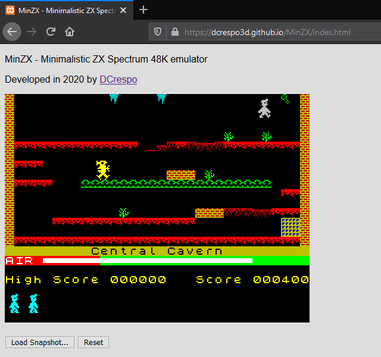

# MinZX
Minimal ZX Spectrum 48K emulator in JavaScript.

This is a minimalistic and incomplete emulator written for learning the architecture of the ZX Spectrum and Z80 assembly programming.

It has a small code base which makes it easy to understand.

## Features
- ZX Spectrum 48K emulation with original ROM.
- Screen emulation with BRIGHT attribute (but no FLASH yet).
- Keyboard emulation, from DOM keydown/keyup events.
- SNA snapshot loading from local filesystem (can play Manic Miner and Jet Set Willy - not included).

### Features not implemented
- Sound.
- Border.
- Snapshot saving.
- Loading from other tape formats.
- So many others...

## Thanks to

- [Molly Howell](https://github.com/DrGoldfire) for her [Z80 emulator in Javascript](https://github.com/DrGoldfire/Z80.js).
- [Amstrad PLC](http://www.amstrad.com) for the ZX Spectrum ROM binaries [liberated for emulation purposes](http://www.worldofspectrum.org/permits/amstrad-roms.txt).
- My uncle Pedro for introducing me to the [ZX81](https://en.wikipedia.org/wiki/ZX81) and the [ZX Spectrum](https://en.wikipedia.org/wiki/ZX_Spectrum).