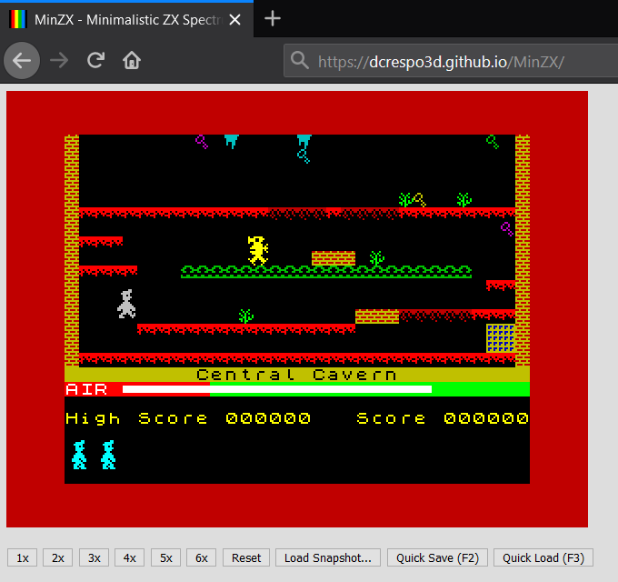

# MinZX
Minimal ZX Spectrum 48K emulator in JavaScript.

This is a minimalistic and incomplete emulator written for learning the architecture of the ZX Spectrum and Z80 assembly programming.

Not ALL games work... but many do. Feel free to load your .SNA files.

It has a small code base which makes it easy to understand.

[Try it here](https://dcrespo3d.github.io/MinZX/index.html). Keyboard required, not for mobile.

## Features
- ZX Spectrum 48K emulation with original ROM.
- Screen emulation with border, BRIGHT and FLASH attributes.
- Keyboard emulation, from DOM keydown/keyup events.
- Sound emulation with 4x supersampling for clear beeper tunes.
- SNA snapshot loading from local filesystem.
- Good (but not perfect) timing, counting processor cycles, vertical interrupts, and a naive contended memory algorithm.

### Features not implemented
- Intra-frame border changes. Border is refreshed once per frame.
- Snapshot saving.
- Loading from other tape formats.
- So many others...

## Thanks to

- [Molly Howell](https://github.com/DrGoldfire) for her [Z80 emulator in Javascript](https://github.com/DrGoldfire/Z80.js).
- [Amstrad PLC](http://www.amstrad.com) for the ZX Spectrum ROM binaries [liberated for emulation purposes](http://www.worldofspectrum.org/permits/amstrad-roms.txt).
- My uncle Pedro for introducing me to the [ZX81](https://en.wikipedia.org/wiki/ZX81) and the [ZX Spectrum](https://en.wikipedia.org/wiki/ZX_Spectrum).